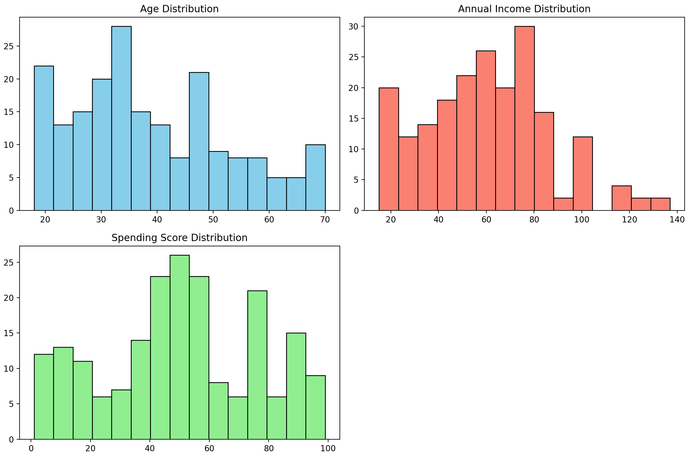
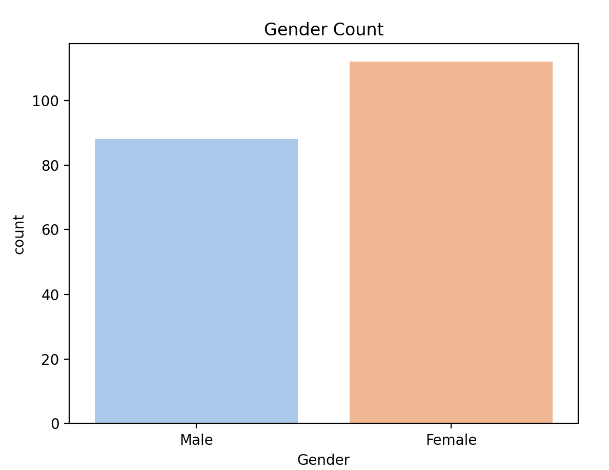
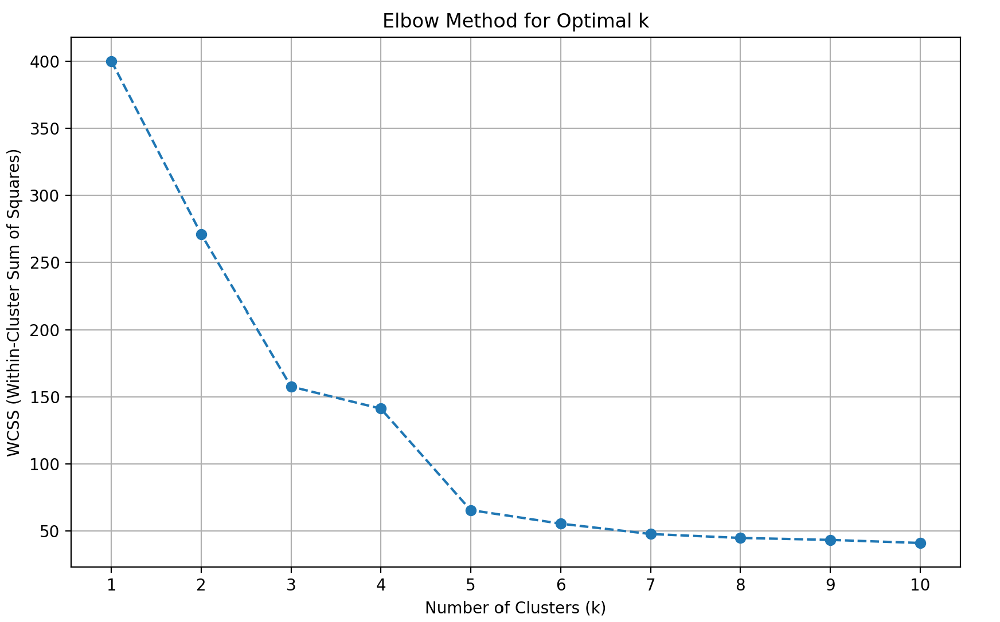
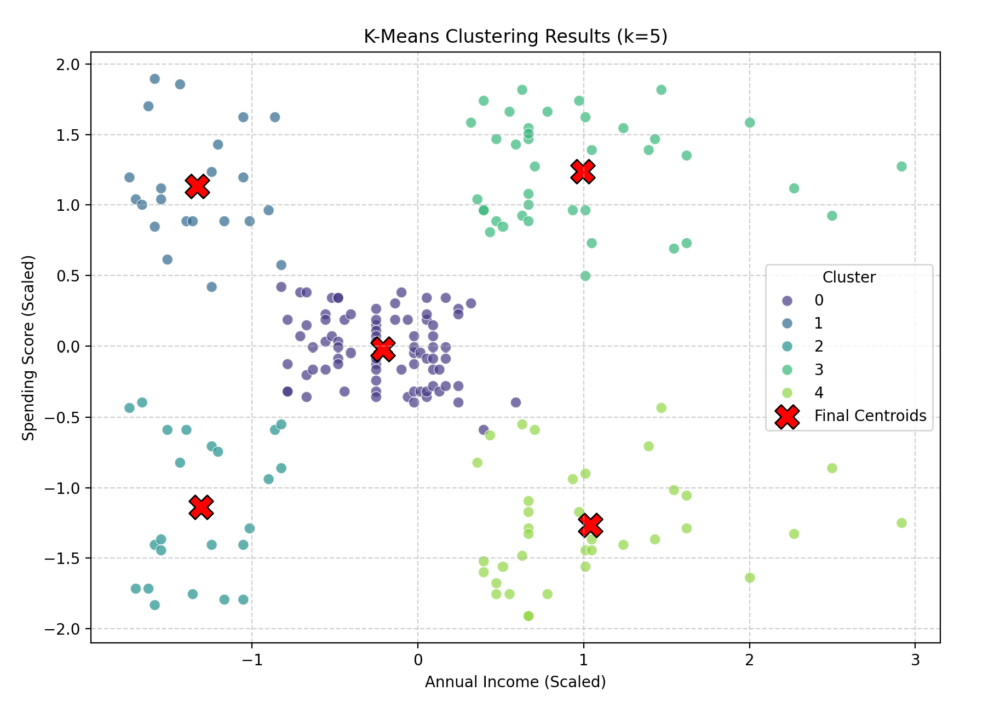
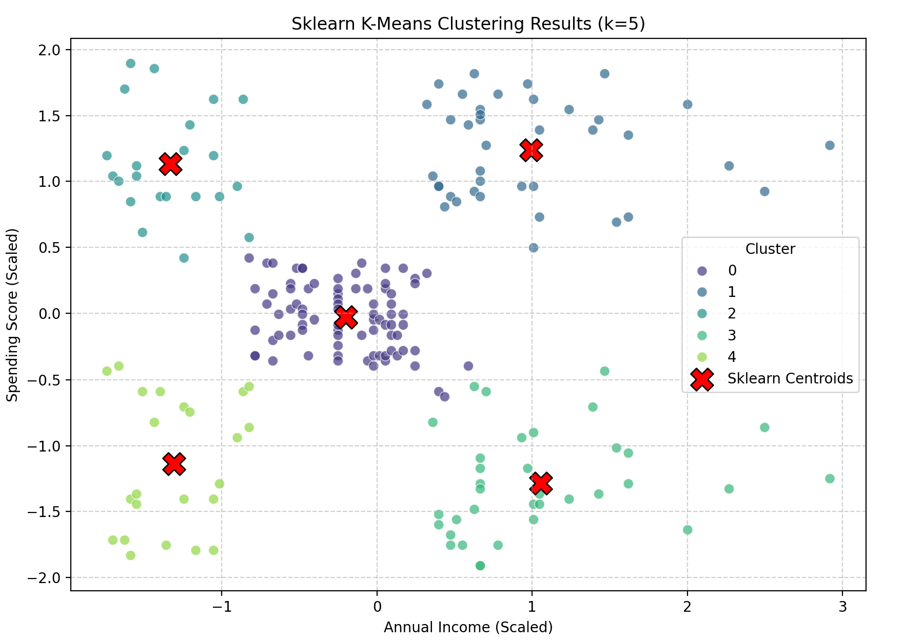

# **Mall Customer Segmentation with K-Means Clustering**

This repository contains Python scripts for **K-Means Clustering**, for **customer segmentation** using the Mall Customer Segmentation Dataset. The project implements both K-Means **from scratch** and the **`scikit-learn` library**

## **Problem Statement**

The goal of this project is to **segment mall customers** into distinct groups based on their demographic and spending habits. This project showcases the application of **K-Means clustering** to uncover valuable insights from unlabeled data.

## **Results**

### 1. **Data Loading and Exploratory Data Analysis (EDA)**

The initial script performs **data loading**, checks for **missing values**, and provides **descriptive statistics**. Histograms and count plots visualize the **distribution of key features**.

#### **Feature Distributions**

#### **Gender Distribution**

### 2. **K-Means Clustering From Scratch**

This script (`kmeans_model_scratch.py`) implements the **K-Means algorithm manually**, including **centroid initialization**, **assignment**, and **update steps**. It also includes the **Elbow Method** for finding the optimal number of clusters.

#### **Optimal K Determination (Elbow Method)**

The **Elbow Method** helps identify the **optimal number of clusters (K)** by plotting the **Within-Cluster Sum of Squares (WCSS)** against different K values.

#### **Clustering Results (From Scratch)**

This scatter plot visualizes the **customer segments** based on 'Annual Income' and 'Spending Score', with **centroids marked**.

#### **Performance Metrics (From Scratch - for K=5)**

* **WCSS (Within-Cluster Sum of Squares):** *65.5789*
* **Silhouette Score:** *0.5539*
* **Calinski-Harabasz Index:** *248.6019*
* **Davies-Bouldin Index:** *0.5708*

### 3. **K-Means Clustering with Scikit-learn**

This script (`kmeans_main_scratch_and_sklearn.py`) utilizes **`sklearn.cluster.KMeans`** for clustering. 

#### **Clustering Results (Scikit-learn)**

This scatter plot visualizes the **customer segments** generated by the scikit-learn K-Means model.

#### **Performance Metrics (Scikit-learn - for K=5)**

* **WCSS (Within-Cluster Sum of Squares):** *65.5684*
* **Silhouette Score:** *0.5547*
* **Calinski-Harabasz Index:** *248.6493*
* **Davies-Bouldin Index:** *0.5722*

## **Conclusion**

This project demonstrates **customer segmentation** using **K-Means clustering**. Both the **"from scratch" implementation** and the **`scikit-learn` library** yield comparable and insightful customer groups. The **Elbow Method** and **Silhouette Score** are important tools for **determining the appropriate number of clusters**.  